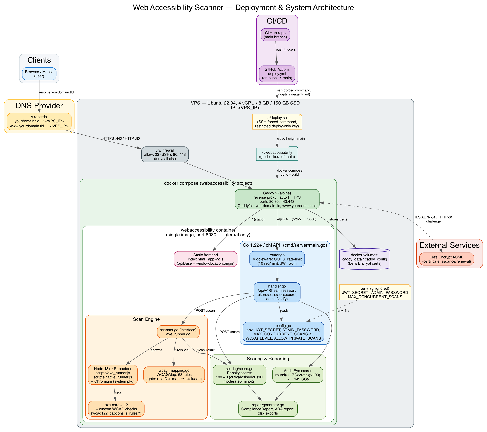

# Web Accessibility Scanner — Tool & Technical Documentation

## 1. Overview

The Web Accessibility Scanner is a self-hosted WCAG 2.1/2.2 accessibility testing tool. A Go backend orchestrates headless-Chromium scans (via a Node.js/Puppeteer worker running axe-core plus custom rules), scores the results with two independent methodologies, and can generate legally-formatted compliance reports for 11 international accessibility standards.

**Stack**: Go 1.22+ (chi router) · Node 18+ (Puppeteer + axe-core 4.12) · JWT (HS256) · Docker · Caddy (reverse proxy / TLS)

---

## 2. Architecture



### Component summary

| Layer | Component | Responsibility |
|---|---|---|
| Edge | DNS + `ufw` firewall | Only ports 22 (SSH), 80, 443 reachable from the internet |
| Edge | Caddy 2 | TLS termination (auto Let's Encrypt), reverse proxy to the app container, serves both apex and `www` hostnames |
| App | Go / chi API | Routing, middleware (CORS, rate limiting, JWT auth), request handling |
| App | Scan Engine | Spawns headless Chromium via Puppeteer, runs axe-core + custom WCAG checks, filters results through the WCAG rule map |
| App | Scoring & Reporting | Two independent scorers (penalty-based, AudioEye element-level), regulatory report generators |
| App | Static Frontend | Single-page app served from the same origin as the API (no separate frontend host/CORS complexity) |
| CI/CD | GitHub Actions | On push to `main`: SSH (restricted, forced-command key) into the VPS → `git pull` → `docker compose up -d --build` |

### Deployment model

The entire application (Go binary + Node/Puppeteer + Chromium + static frontend) ships as **one Docker image**, built from a multi-stage `Dockerfile`. In production it runs behind a separate **Caddy** container that handles TLS and reverse-proxies to the app container over the internal Docker network — the app container itself exposes no host port.

---

## 3. Configuration Reference

All configuration is via environment variables (typically supplied through a `.env` file, gitignored).

| Variable | Required | Default | Purpose |
|---|---|---|---|
| `JWT_SECRET` | No | auto-generated random secret at startup | HS256 signing key for all issued JWTs |
| `ADMIN_PASSWORD` | No | unset (admin console disabled) | Password gating the admin console / `POST /api/v1/admin/verify` |
| `ALLOW_PRIVATE_SCANS` | No | `false` | Allows scanning of localhost/private IP ranges (SSRF protection bypass — use with caution) |
| `WCAG_LEVEL` | No | `AA` | Default conformance level (`AA` or `AAA`) when not specified per-request |
| `PORT` | No | `8080` | Port the Go server listens on inside the container |
| `SCAN_TIMEOUT_SECONDS` | No | `180` | Max wall-clock time per scan before it's aborted |
| `MAX_CONCURRENT_SCANS` | No | `5` | Ceiling on simultaneous scans; each spawns its own headless Chromium instance |
| `SCORING_FORMULA` | No | `compliance` | `compliance` (pass-rate based) or `penalty` (fixed deductions per severity) |
| `ACTIVE_ENGINE` | No | `native` | `native` (custom rule engine) or `axe` (axe-core via Puppeteer) |
| `NODE_BIN` | No | `node` | Path to the Node.js binary used to invoke the scan scripts |
| `AXE_RUNNER_SCRIPT` | No | `scripts/axe_runner.js` | Entry point for axe-core-based scans |
| `NATIVE_RUNNER_SCRIPT` | No | `scripts/native_runner.js` | Entry point for the native custom-rules engine |
| `FRONTEND_DIR` | No | `./frontend` | Directory the static SPA is served from |

**Resource sizing note**: `MAX_CONCURRENT_SCANS` directly multiplies memory usage — each concurrent scan is a separate headless Chromium process (roughly 300MB–1GB depending on page weight). Size container memory limits accordingly (e.g. `MAX_CONCURRENT_SCANS=3` needs headroom for 3 simultaneous Chromium instances plus the Go process and OS overhead).

---

## 4. API Reference

Base path: `/api/v1`. Most endpoints require a Bearer JWT (`Authorization: Bearer <token>`). Rate limit: **10 requests/minute per IP**.

### 4.1 Auth & Session

**`GET /api/v1/session`** — no auth required
Issues a short-lived guest JWT for browser/frontend use.
```json
// 200 response
{ "token": "eyJ...", "expires_in": 1200 }
```

**`POST /api/v1/token`** — no auth required
Server-to-server token exchange using the shared `JWT_SECRET`.
```json
// request
{ "secret": "the-jwt-secret" }
// 200 response
{ "token": "eyJ..." }   // valid 30 minutes
```
`400` missing secret · `401` invalid secret · `500` server has no `JWT_SECRET` configured.

**`POST /api/v1/admin/verify`** — no auth required
```json
// request
{ "password": "admin-password" }
// 200 response
{ "status": "ok", "admin_token": "eyJ...", "expires_in": 1800 }
```
`401` wrong password · `503` `ADMIN_PASSWORD` not configured on the server. Comparison is constant-time (no timing side-channel).

### 4.2 System

**`GET /api/v1/health`** — no auth required
```json
{ "status": "ok", "time": "2026-07-11T19:00:00Z", "version": "1.0.0" }
```

**`GET /api/v1/`** — no auth required — API metadata and endpoint list.

**`GET /api/v1/secret`** / **`POST /api/v1/secret`** — Bearer JWT required
Reads/rotates the active JWT signing secret at runtime. **Operational use only — never expose publicly.**

### 4.3 Scanning

**`POST /api/v1/scan`** — Bearer JWT required
```json
// request
{
  "url": "https://example.com",
  "wcag_level": "AA",       // "AA" | "AAA", optional
  "depth": 0,                // 0 = single page, 1 = follow same-origin links (up to 10)
  "visual_report": false     // include annotated screenshot HTML report
}
```
```json
// 200 response (abridged)
{
  "url": "https://example.com",
  "scanned_at": "2026-07-11T19:00:00Z",
  "duration_ms": 4820,
  "summary": {
    "violations": 3, "passes": 41, "incomplete": 2,
    "wcag_level": "AA", "score": 75, "grade": "B",
    "compliance_pct": 93.18, "audioeye_score": 78
  },
  "violations": [
    {
      "id": "image-alt", "impact": "critical",
      "description": "...", "help": "...", "help_url": "...",
      "tags": ["wcag2a", "wcag111"],
      "nodes": [{ "html": "", "target": ["img[src$='hero.png']"],
                  "bbox": {"x":0,"y":120,"width":1200,"height":400} }],
      "dev_suggestion": {
        "title": "Add descriptive alt text",
        "fix_steps": ["Add an alt attribute...", "Use alt=\"\" if decorative"],
        "code_before": "",
        "code_after": "",
        "language": "html"
      }
    }
  ],
  "pass_rules": [{ "id": "bypass", "node_count": 1 }],
  "audioeye": { "score": 78, "grade": "C", "sc_breakdown": { "1.1.1": {"failed_elements":1,"tested_elements":5,"failure_rate":0.2,"weight":0.0159,"weighted_rate":0.0032} }, "scs_evaluated": 63 }
}
```
`400` invalid request · `401` bad/missing token · `403` SSRF-blocked private address · `429` rate limited · `500` scan failure (Chromium crash, network timeout).

**`POST /api/v1/score`** — Bearer JWT required
Same request shape as `/scan`; returns a compact score breakdown instead of the full violation list (impact-level counts, penalty totals, a human-readable recommendation string, plus the AudioEye score).

### 4.4 Compliance Reports

**`POST /api/v1/report/{standard}`** — Bearer JWT required, where `{standard}` is one of:
`ada` · `vpat` · `en301549` · `eaa` · `uk` · `aoda` · `aca` · `dda` · `gigw` · `cvaa` · `bitv`

```json
// request
{
  "url": "https://example.com",
  "format": "pdf",           // "pdf" | "html"
  "depth": 0,
  "meta": {
    "product_name": "My Website", "vendor_name": "ACME Corp",
    "product_version": "2.0", "contact_info": "a11y@example.com", "notes": "..."
  }
}
```
Response is the generated file (PDF binary or HTML document) built from a `ComplianceReport`: a per-WCAG-success-criterion conformance table (`Supports` / `Partially Supports` / `Does Not Support` / `Not Applicable` / `Not Evaluated` / `Tested – Inconclusive`), each with narrative remarks and, where automated data exists, element-level failure-rate stats.

### 4.5 Standard error envelope
```json
{ "error": "short message", "details": "optional extended context" }
```

---

## 5. Scoring Methodology

### 5.1 Penalty scorer (`SCORING_FORMULA=penalty`)
```
score = max(0, 100 − Σ penalty)
```
| Impact | Penalty |
|---|---|
| critical | −20 |
| serious | −10 |
| moderate | −5 |
| minor | −2 |

### 5.2 Compliance scorer (`SCORING_FORMULA=compliance`, default)
```
score = round(passes / (passes + violations + incomplete) × 100)
```
`incomplete` is included in the denominator specifically to avoid overstating compliance on pages with a lot of unverifiable/manual-review checks.

### 5.3 AudioEye scorer (always computed, supplementary)
Element-level, per-success-criterion failure rate, weighted equally across all evaluated SCs:
```
for each SC:  failure_rate = failed_elements / tested_elements
weight = 1 / (number of SCs evaluated)
weighted_failure = Σ(weight × failure_rate)
score = round((1 − weighted_failure) × 100)
```
If zero SCs were evaluated, score is forced to `0` with a `warning` field noting the result isn't a valid compliance score (rather than silently reporting a misleadingly perfect score).

### 5.4 Grade thresholds (shared by all scorers)
A ≥ 90 · B ≥ 75 · C ≥ 40 · D ≥ 25 · F < 25

---

## 6. WCAG Rule Mapping

`internal/models/wcag_mapping.go` maps every scan rule ID (axe-core + custom) to the WCAG success criteria it tests. This mapping is a **hard gate**: any rule ID not present in the map is excluded from scoring entirely, even if the underlying engine reports it. This keeps the score meaningful — only checks with a defined, auditable WCAG mapping count toward compliance.

- **63 rules** mapped
- **43 A/AA** success criteria + **14 AAA** covered
- Implementation status: **14 fully implemented**, **21 partial** (automated but heuristic), **8 known gaps**

### Custom checks (beyond axe-core)

| Rule ID | WCAG SC | What it checks |
|---|---|---|
| `video-captions-present` / `-track-src` / `-track-lang` | 1.2.2 | `<video>` elements have a valid `<track kind="captions">` with `src`/`srclang` |
| `color-only-indicator` | 1.4.1 | State (error/focus/etc.) isn't conveyed by color alone |
| `focus-order-cycling` | 2.1.2, 2.4.3 | Tab order cycles through all interactive elements without trapping; modals trap and release focus correctly |
| `non-text-contrast` | 1.4.11 | UI component borders/outlines meet 3:1 contrast against background |
| `error-identification` | 3.3.1 | Inputs marked `aria-invalid` have a linked error message via `aria-errormessage`/`aria-describedby` |
| `focus-visible` | 2.4.7 | Focused elements have a visible indicator meeting 3:1 contrast |
| `resize-text` | 1.4.4 | Page reflows cleanly at 200% zoom without clipping or horizontal scroll |
| `on-focus-context-change` | 3.2.1 | Focus events don't trigger unexpected navigation/dialogs |
| `orientation-lock` | 1.3.4 | Content isn't restricted to a single device orientation |
| `multiple-ways` | 2.4.5 | Page offers more than one way to locate content (search, sitemap) |
| `content-on-hover` | 1.4.13 | Hover-triggered content is dismissible (Escape), hoverable, and persistent |
| `sensory-characteristics` | 1.3.3 | Instructions don't rely solely on shape/color/position cues |
| `pointer-gestures` | 2.5.1 | Multi-point/path gestures have single-pointer alternatives |
| `timing-adjustable` | 2.2.1 | No unannounced meta-refresh or short auto-timeout without user control |
| `meaningful-sequence-*` | 1.3.2 | Reading order isn't broken by `tabindex`, CSS `order`, absolute positioning, or grid auto-placement |

Most heuristic checks report as **incomplete** rather than **violation** — they flag a pattern that needs human judgment rather than asserting a definitive failure.

---

## 7. Frontend

The SPA (`frontend/index.html` + `frontend/app-v2.js`) is served from the same origin as the API by design — `apiBase()` resolves to `window.location.origin`, so no CORS configuration or environment-specific API URL is needed regardless of which domain/IP the app is deployed behind.

Key client-side behavior:
- Guest JWT obtained automatically via `GET /api/v1/session` on load, cached in `localStorage`, auto-renewed ~17 minutes in
- Admin console gated behind a 5-click trigger + password, session stored in `sessionStorage` (30-minute expiry)
- Scan depth 1 (follow links) can run in **serial** (backend processes links sequentially) or **parallel** (browser fires concurrent requests using the shared session token) mode, toggle persisted in `localStorage`
- Results rendering includes screenshot-overlay bounding boxes (from `Node.bbox`) when `visual_report: true` is requested

---

## 8. Deployment

### 8.1 Runtime
- Single Docker image (multi-stage build): Go binary compiled in stage 1, copied into a Node 22 + Chromium runtime image in stage 2
- Runs as non-root (`appuser`) inside the container
- Fronted by a separate **Caddy** container for automatic HTTPS (Let's Encrypt, both TLS-ALPN-01 and HTTP-01 challenge support) and reverse proxying
- `docker-compose.yml` defines both services plus named volumes for Caddy's certificate storage

### 8.2 CI/CD
GitHub Actions (`.github/workflows/deploy.yml`) triggers on every push to `main`:
1. SSH into the VPS using a **dedicated, restricted deploy key** — `authorized_keys` forces the connection to run only `~/deploy.sh` (`no-pty`, `no-agent-forwarding`, `no-port-forwarding`), regardless of what command the client sends
2. `deploy.sh` runs `git pull origin main` followed by `docker compose up -d --build`

This means a compromised CI secret can, at worst, redeploy the current `main` branch — it cannot open an interactive shell, forward ports, or run arbitrary commands on the host.

### 8.3 Network/security posture
- `ufw` firewall: only 22 (SSH), 80, 443 open
- SSRF protection blocks scans of `127.x`, `10.x`, `192.168.x`, `172.16.x`, `::1`, and `localhost` unless `ALLOW_PRIVATE_SCANS=true`
- `.env` (containing `JWT_SECRET`, `ADMIN_PASSWORD`) is gitignored and lives independently on each machine — never committed
- Admin password comparison uses `crypto/subtle` (constant-time) to avoid timing attacks

---

## 9. Local Development

```bash
go run cmd/server/main.go        # start the API server
cd scripts && npm install        # install scanner dependencies
```

**Build & test:**
```bash
go build ./...                   # build
go test ./... && cd scripts && npm test   # test (Go + JS)
gofmt -l .                       # lint
```

---

## 10. Repository Map

| Path | Purpose |
|---|---|
| `cmd/server/main.go` | Application entry point |
| `internal/api/handler.go` | Route handlers |
| `internal/api/router.go` | chi router setup |
| `internal/api/middleware.go` | CORS, rate limiting, JWT |
| `internal/config/config.go` | Environment variable loading |
| `internal/models/report.go` | Core types (`ScanResult`, `Violation`, `Summary`, etc.) |
| `internal/models/wcag_mapping.go` | Rule → WCAG SC mapping (scoring gate) |
| `internal/models/suggestions.go` | `DevSuggestion` fix-guidance type |
| `internal/scanner/scanner.go` | Scanner interface |
| `internal/scanner/axe_runner.go` | axe-core engine invocation |
| `internal/scoring/score.go` | Both scorers, grade thresholds, `ComplianceReport` builder |
| `internal/report/generator.go` | Regulatory report generation |
| `scripts/axe_runner.js` | Puppeteer + axe-core scan script |
| `scripts/native_runner.js` | Custom rule engine entry point |
| `scripts/rules/*.js` | Individual custom WCAG checks |
| `scripts/checks/wcag122_captions.js` | Video caption checks |
| `frontend/index.html` / `app-v2.js` | Single-page frontend |
| `openapi.yaml` | OpenAPI spec (kept in sync with `handler.go`) |
| `Dockerfile` | Multi-stage build (Go + Node/Chromium runtime) |
| `docker-compose.yml` | App + Caddy service definitions |
| `Caddyfile` | Reverse proxy / TLS config |
| `.github/workflows/deploy.yml` | Auto-deploy on push to `main` |
